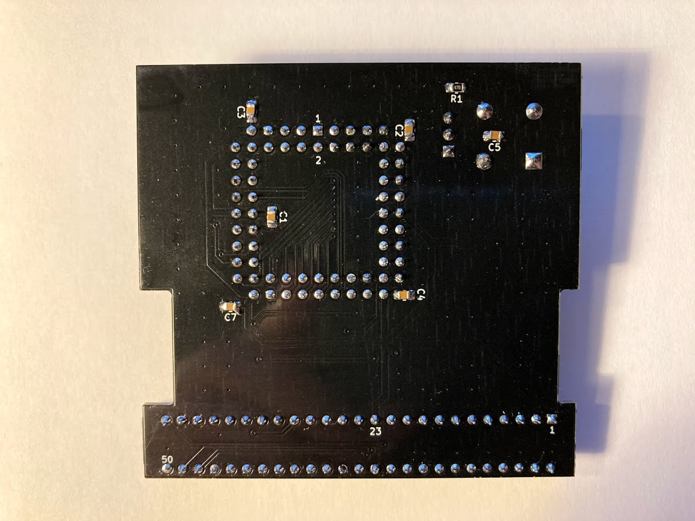

# Macintosh Classic II FPU card

This repo contains a KiCAD design of an expansion card that adds an MC68882 FPU to your Macintosh Classic II. The board has two layers to keep the PCB cost down. It offers a switchable clock source between the system clock (16 MHz, synchronous operation) and a crystal oscillator on the board (40 MHz, asynchronous operation; tested with MC68882FN40A, the rumours claim 50 MHz will work too).

### Results

After plugging in the card, it should be immediately visible in some tools (here System Information of MacBench):

The board dramatically improves the Floating Point performance of the computer. MacBench 1.0 with an FPU@16 MHz (system clock) reports over a 13x improvement.
When using an external 40 MHz oscillator, the Floating Point result goes up even a bit more - to 15.7x (it's not proportional to the clock frequency as at some point the slow 16-bit bus becomes a limiting factor):

(look at the Floating Point row)

### Order a PCB

If you want to order a PCB directly, I have created a model on PCBWay:

### Bill of Materials

| Qty | Value           | Device             | Package              | Parts                                                  | Digikey reference             | 
|-----|-----------------|--------------------|----------------------|--------------------------------------------------------|-------------------------------|
| 1   |                 | MC68882FN40A       | PLCC68               | IC1                                                    |                               | 
| 1   |                 | PLCC68 socket      | PLCC68               | IC1                                                    |                               | 
| 1   |                 | TE 5-532955-8      |                      | J1                                                     | A34313-ND                     | 
| 1   |                 | Pin Header 2.54mm  | 3 pins               | J2                                                     |                               |
| 5   | 100nF X7R       | SMD capacitor      | 0805                 | C1-C5                                                  |                               | 
| 1   | 10uF 10V        | Tantalum Cap       | A (3216)             | C6                                                     | 399-4788-1-ND                 | 
| 1   | 51 ohm          | SMD resistor       | 0805                 | R1                                                     |                               | 
| 1   | 40 MHz          | Crystal oscillator | DIP-8                | X1                                                     |                               | 

(sorry, I had most components at hand, so I only have Digikey references for the rather specific ones)

### Pictures

### References

The MC68000 KiCAD library from https://dev.sigpipe.me/DashieElectronics/Jackalope
